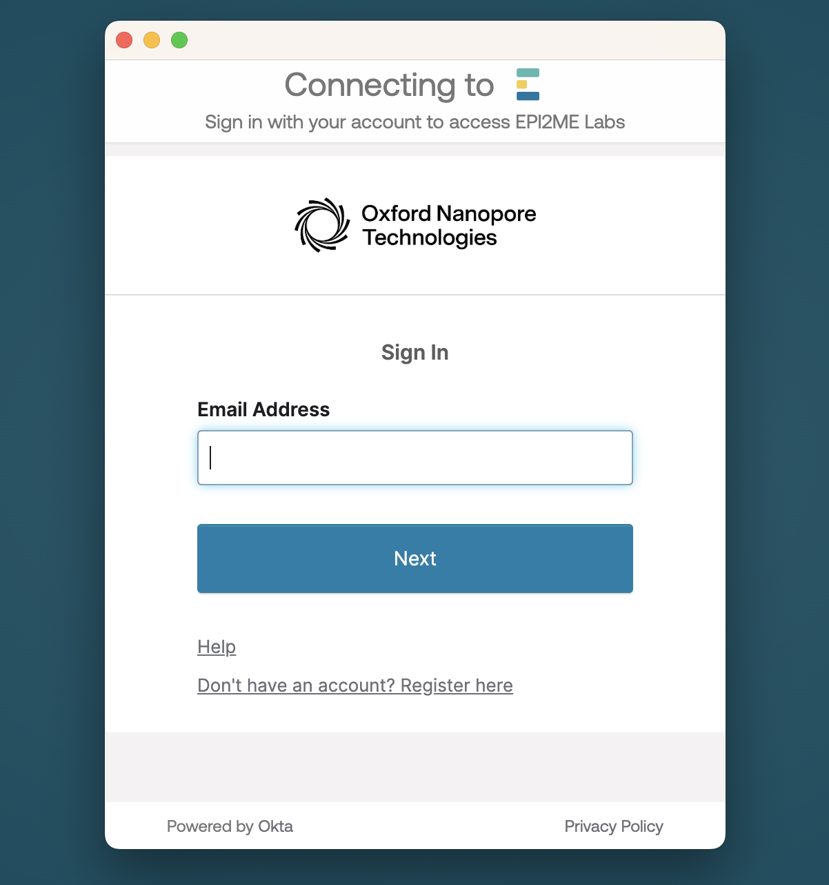
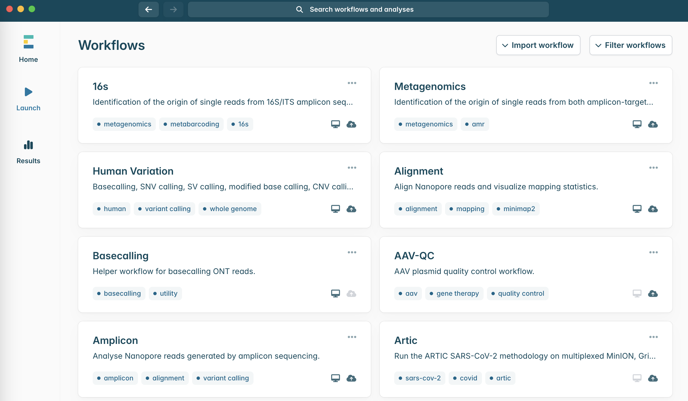
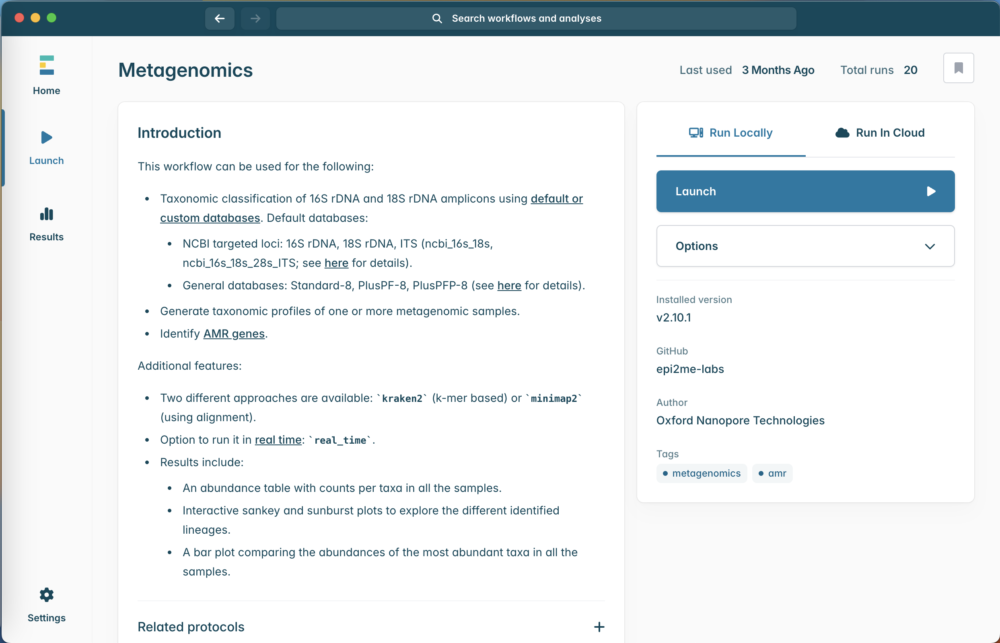
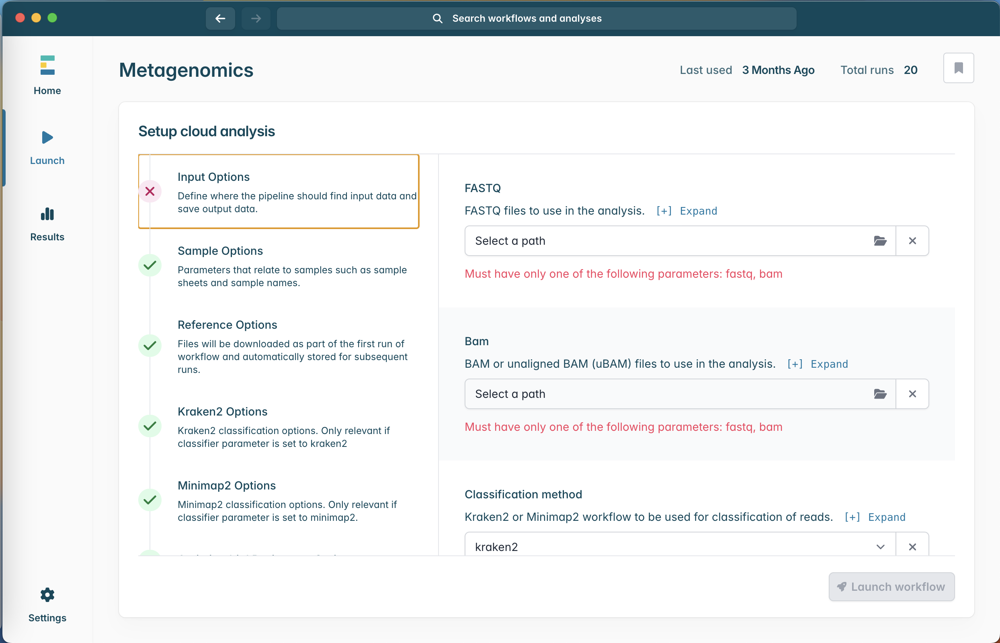
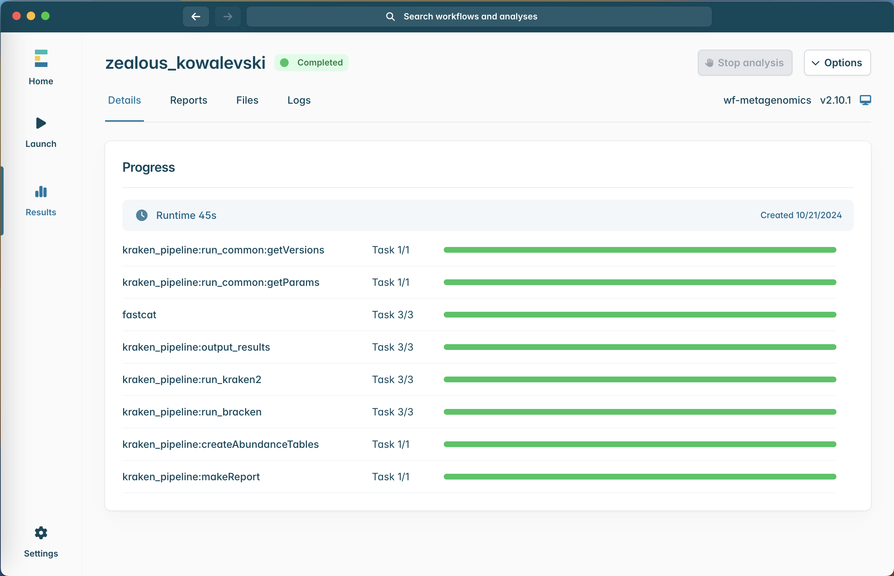

# Metagenomics analysis

Metagenomics is the study of genetic material recovered directly from environmental samples, offering insights into the diversity and functions of microbial communities. Epi2Me, a cloud-based platform by Oxford Nanopore Technologies, simplifies the analysis of metagenomic data. Below is a comprehensive guide to analyzing metagenomics using Epi2Me.

## Software for metagenomics analysis:

{width="229"}

-   Epi2Me lab

    {width="436"}

-   Docker

## **Materials:**

Processed data (.fasq or .bam)

Sample sheet (Optional)

### Guide to Analyzing Metagenomics Using Epi2Me

Create an Account

Register for an account at Epi2Me.

### Upload Data:

Log in to your Epi2Me account.

Select the Appropriate Workflow

Epi2Me provides several workflows tailored to specific applications. For metagenomics, the most relevant workflows are:

Launch workflow

### Run the Workflow:

Upload your data (fastq or bam files)

After uploading your data, choose the workflow and start the analysis.

Monitor progress via the Epi2Me dashboard.

### Get the report

Example:

[Report](src/page/Metagenomics/wf-metagenomics-report.html)
